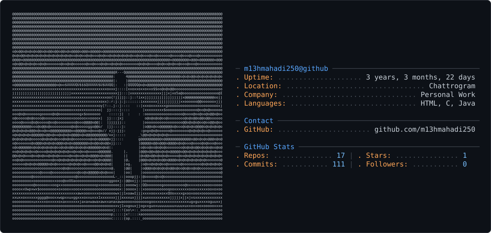

  

<picture>
  <source media="(prefers-color-scheme: dark)" srcset="dark_mode.svg" />
  <source media="(prefers-color-scheme: light)" srcset="light_mode.svg" />
  
</picture>

<h3 align="center">FROM BANGLADESH</h3>

 

 
  

 

 
<h2 align="center"> LANGUAGE | FRAMEWORK TOOLS</h2>
 

   
   
   
  

 

  

  <h2>🐍 My Contributions 🐍</h2>
 
  

   

  

 

 
